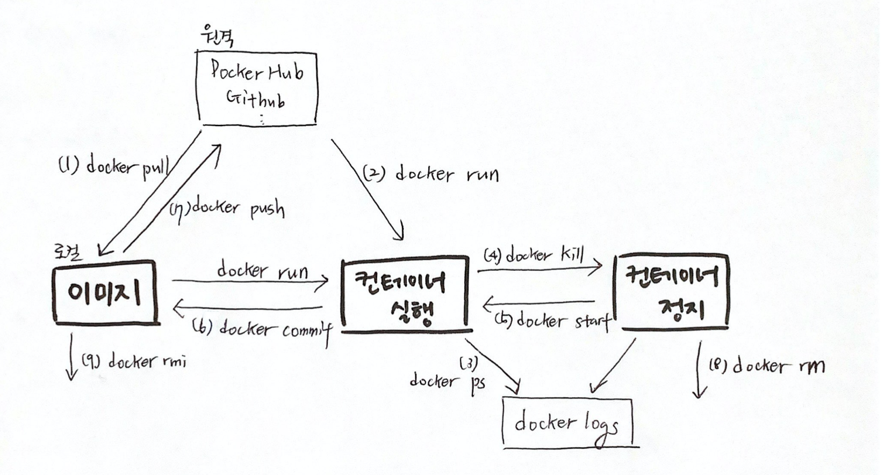
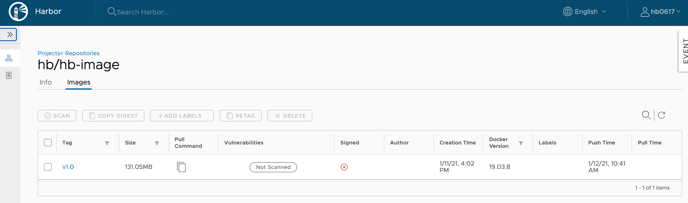
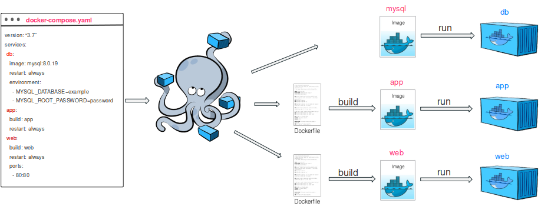

# docker-study

<br/>

> ## 개요 
Docker는 컨테이너 기반 가상화 도구이다.  <br><br>


> ## Docker Architecture
<br>

<b>Client</b> : 도커 커맨드는 컨테이너를 조작하는 CLI로 도커 데몬의 클라이언트이다. <br>
<b>Daemon</b>: 도커 데몬은 클라이언트인 도커 커맨드의 명령을 받아들여 도커 오브젝트인 이미지, 컨테이너, 볼륨, 네트워크 등을 관리한다.<br>
<b>Registry</b> : 도커 Image가 저장되어 있는 장소이다. 대표적으로 Docker Hub가 있다. Registry는 Public Registry와 Private Registry가 있다.<br>
<b>Image</b> : 도커 Daemon을 통해 Container로 실행 가능하도록 필요한 프로그램, 라이브러리, 소스 등이 설치된 파일이다.

<br><br>


>## 컨테이너의 생명주기와 Docker Command
컨테이너는 이미지, 실행, 정지의 세 가지 상태를 가진다. 

<br/>


(1) 이미지 받기<br>
docker pull 이미지이름:tag 
```bash
$ docker pull nginx:latest
```
(2) 컨테이너 실행<br>
docker run <옵션> 이미지이름:tag <커맨드> <인자>
```bash
$ docker run -it --name test1 nginx:latest /bin/sh
```
> -it 옵션 : 이 두 옵션(-i, -t)은 컨테이너를 종료하지 않은체로, 터미널의 입력을 계속해서 컨테이너로 전달하기 위해서 사용.<br><br>
> --name : 컨테이너에 이름을 부여 <br><br>
> -e : Docker 컨테이너의 환경변수를 설정. -e 옵션을 사용하면 Dockerfile의 ENV 설정도 덮어써진다.<br><br>
> -p : 호스트(host) 컴퓨터에서 컨테이너 내부 에서 리스닝하고 있는 포트로 접속할 수 있도록 설정.<br><br>
> -v, -mount : 호스트와 컨테이너 간의 볼륨(volumn) 설정. 호스트(host) 컴퓨터의 파일 시스템의 특정 경로를 컨테이너의 파일 시스템의 특정 경로로 마운트(mount)해줌.<br><br>
> -w: Dockerfile의 WORKDIR 설정을 덮어쓰기 위해서 사용<br><br>
> --entrypoint : Dockerfile의 ENTRYPOINT 설정을 덮어쓰기 위해서 사용<br><br>
> --rm : 컨테이너를 일회성으로 실행할 때 사용. 컨테이너가 종료될 때 컨테이너와 관련된 리소스(파일 시스템, 볼륨)까지 깨끗이 제거

(3) 컨테이너 상태 출력
```bash
$ docker ps 
$ docker ps -a #정지된 컨테이너까지 확인
```

(4) 컨테이너 정지
- 커맨드를 지정하지 않고 컨테이너를 실행하면 실행하자마자 컨테이너의 PID=1인 프로세스가 종료된다. 
  
```bash
❯ docker run ubuntu                                                  10:02:36
Unable to find image 'ubuntu:latest' locally
latest: Pulling from library/ubuntu
da7391352a9b: Pull complete 
14428a6d4bcd: Pull complete 
2c2d948710f2: Pull complete 
Digest: sha256:c95a8e48bf88e9849f3e0f723d9f49fa12c5a00cfc6e60d2bc99d87555295e4c
Status: Downloaded newer image for ubuntu:latest
~ 11s ❯ docker ps                                                      10:02:55
CONTAINER ID   IMAGE     COMMAND   CREATED   STATUS    PORTS     NAMES
~ ❯ docker ps -a                                                       10:02:59
CONTAINER ID   IMAGE         COMMAND       CREATED         STATUS                     PORTS     NAMES
a0c540ee9a23   ubuntu        "/bin/bash"   9 seconds ago   Exited (0) 8 seconds ago             kind_kowalevski
```

- docker stop <컨테이너ID> | 컨테이너명
- docker kill <컨테이너ID> | 컨테이너명 (강제종료)
  
```bash
#실행된 프로세스와 터미널 상에서 입출력 주고받기위해
$ docker attach d3fef9c0f9e9
[root@d3fef9c0f9e9 /]#

#종료
[root@d3fef9c0f9e9 /]# exit

$ docker stop a0c540ee9a23
$ docker kill a0c540ee9a23
```

<br>

(5) 컨테이너 재기동<br>
docker start <옵션> <컨테이너ID/name>
```bash
$ docker start a0c540ee9a23
```

(6) 컨테이너의 변경사항을 리포지터리에 저장
<br> 실행중인 컨테이너에도 필요한 패키지 설치나 업데이트를 할 수 있다. 이때 변경된 컨테이너의 상태를 이미지로 만들어 리포지터리에 보관할 수 있다.

```bash
❯ docker run -it centos:7 bash                                                                          10:25:09
[root@de188f9bdb03 /]# yum update -y
Loaded plugins: fastestmirror, ovl
Determining fastest mirrors
 * base: mirror.navercorp.com
 * extras: mirror.navercorp.com
 * updates: mirror.navercorp.com
<생략>
Complete!
[root@de188f9bdb03 /]# yum install -y git
Loaded plugins: fastestmirror, ovl
Loading mirror speeds from cached hostfile
 * base: mirror.navercorp.com
 * extras: mirror.navercorp.com
 * updates: mirror.navercorp.com
Resolving Dependencies
--> Running transaction check
<생략>
```

변경된 컨테이너 상태 저장

```bash
$ docker ps                                                                                                 10:29:48
CONTAINER ID   IMAGE      COMMAND   CREATED          STATUS          PORTS     NAMES
de188f9bdb03   centos:7   "bash"    21 seconds ago   Up 20 seconds             suspicious_euler
$ docker commit de188f9bdb03 centos:7-git                                                            
sha256:3f39901c8225f7763e4e6ca31149d99808733704354cfbc13b1ab58fa5be0c44
```

(7) docker push
```bash
$ docker push <이미지 이름>
```


(8) 컨테이너/이미지 삭제
```bash
$ docker rmi <이미지ID>
$ docker rm <컨테이너ID>

#모든 docker이미지 삭제
$ docker rmi $(docker images -q) 

#종료된 모든 컨테이너를 삭제
$ docker rm $(docker ps -a -q)
```

(10) 실행중인 컨테이너에 접속(해당 컨테이너의 shell에 접속)
```bash
[hb0617@k8s-dev ~]$ docker exec -it hb-container sh
/workspace/test # ls
Dockerfile        go.sum            test1
go.mod            run_my_docker.sh  test1.go
```


<br><br>

># Dockerfile
이미지를 직접 빌드하는 스크립트가 기재된 파일로서, 다음과 같은 내용을 담고있다.<br>
1. 베이스 이미지의 repository
2. 설치할 패키지
3. 소스코드와 설정파일
4. 컨테이너 기동 시 실행될 명령어

<br>

### Dockerfile 작성
Exmaple

```docker
FROM golang:alpine as builder

WORKDIR /workspace/test
COPY . .

RUN go get -d -v
RUN go build -o test1 test1.go

ENTRYPOINT ["/workspace/test/test1"]
CMD ["/workspace/test/test1"]
```

FROM  : golang 이미지를 가져와서,<br>
WORKDIR : 내 workspace로 이동 후 <br>
COPY : 이 위치에 copy 해주고<br>
RUN : (이 위치에서) test1.go build를 통해 test1 이란 이름의 exe 바이너리 파일 생성<br>
ENTRYPOINT, CMD : 컨테이너 실행과 동시에 명령어 실행

<br>

### Dockerfile 작성법 

FROM : 컨테이너의 베이스 이미지 지정

```docker
FROM <이미지>:<태그>
FROM golang:1.15
```

WORKDIR : Dockerfile 내부에서 사용되는 WORKDIR 명령은 작업용 디렉터리를 설정하기 위해 사용

```docker
WORKDIR /workspace/test
```

RUN : 컨테이너의 베이스 이미지에서 커맨드를 실행

```docker
RUN <커맨드>
RUN apt-get update && apt-get install -y vim apache2
```

COPY: 컨테이너 내부에 파일을 복사한다. 

```docker
# 현재 index.html 파일을 /var/www/html/ 경로에 복사한다.
COPY index.html /var/www/html/  

# 현재 위치의 모든 파일을, 현재위치 경로에 복사
COPY . .
```

ADD: ADD : COPY명령문과 비슷하나 일반 파일 뿐만 아니라 압축 파일이나 네트워크 상의 파일도 사용할 수 있다.

```docker
ADD index.html /var/www/html/
ADD . .
```

CMD : 이미지를 바탕으로 생성된 컨테이너 실행 시 매번 명령을 실행. (Docker run / Docker start)<br>
참고로 하나의 CMD만 작성할 수 있으며, 중복일 경우 맨 마지막 하나만 유효하다.

```docker
CMD ["/workspace/test/test1"]
```

ENTRYPOINT : Dockerfile에서 빌드한 이미지를 컨테이너로 생성(Docker run)할때 단 한번만 실행.

```docker
ENTRYPOINT ["/workspace/test/test1"]
```


<br><br>

### Dockerfile build 후 실행

```bash
$ docker build -t d3 .
$ docker run -it -p8888:1322 --name test01 d3 /bin/sh
```

위 내용을 shell script를 작성해서 편리하게 실행할 수도 있다.
<br>
run_my_docker.sh파일 작성

```bash
docker stop hb-container
docker rm hb-container
docker build -t hb-image .
docker run -it -p:8888:{컨테이너 포트} --name hb-container hb-image /bin/sh
```

실행

```bash
[hb0617@k8s-dev test]$ sh run_my_docker.sh
hb-container
hb-container
Sending build context to Docker daemon  10.24kB
Step 1/7 : FROM golang:alpine as builder
 ---> 1463476d8605
Step 2/7 : WORKDIR /workspace/test
 ---> Using cache
 ---> 372938087652
Step 3/7 : COPY . .
 ---> da837dd7def5
Step 4/7 : RUN go get -d -v
 ---> Running in 5248577d4c68
go: downloading github.com/labstack/echo v3.3.10+incompatible
go: downloading github.com/labstack/gommon v0.3.0
go: downloading golang.org/x/crypto v0.0.0-20201221181555-eec23a3978ad
go: downloading github.com/dgrijalva/jwt-go v3.2.0+incompatible
go: downloading github.com/valyala/fasttemplate v1.0.1
go: downloading github.com/mattn/go-colorable v0.1.2
go: downloading github.com/mattn/go-isatty v0.0.9
go: downloading github.com/valyala/bytebufferpool v1.0.0
go: downloading golang.org/x/sys v0.0.0-20191026070338-33540a1f6037
go: downloading golang.org/x/net v0.0.0-20190404232315-eb5bcb51f2a3
go: downloading golang.org/x/text v0.3.0
Removing intermediate container 5248577d4c68
 ---> 50cab91af847
Step 5/7 : RUN go build -o test1 test1.go
 ---> Running in d70e3b16e2b0
Removing intermediate container d70e3b16e2b0
 ---> 6edb127ed083
Step 6/7 : ENTRYPOINT ["/workspace/test/test1"]
 ---> Running in ad083a649d64
Removing intermediate container ad083a649d64
 ---> dccc62b63c21
Step 7/7 : CMD ["/workspace/test/test1"]
 ---> Running in f930476d6d23
Removing intermediate container f930476d6d23
 ---> 2e2a103a4daf
Successfully built 2e2a103a4daf
Successfully tagged hb/image:latest

   ____    __
  / __/___/ /  ___
 / _// __/ _ \/ _ \
/___/\__/_//_/\___/ v3.3.10-dev
High performance, minimalist Go web framework
https://echo.labstack.com
____________________________________O/_______
                                    O\
⇨ http server started on [::]:1322

^C[hb0617@k8s-dev test]$ docker ps
CONTAINER ID        IMAGE               COMMAND                  CREATED             STATUS              PORTS                    NAMES
10f3511a0914        hb-image            "/workspace/test/tes…"   9 seconds ago       Up 8 seconds        0.0.0.0:8888->1322/tcp   hb-container

```

<br><br>

> # Docker Registry 
Docker image를 저장하는 저장소이다. 로컬에 저장할 수 있는 private 방식과 외부에 원격 저장할 수 있는 Pulic 방식이 존재한다. <br>

- Private Registry는 개인 저장소라고도 하며 Docker hub에서 제공하는 registry 이미지를 사용 해 컨테이너에서 이미지를 로컬 저장하는 방식이다. 


Registry 이미지 다운로드
```bash
$ docker image pull registry
```

다운받은 registry 이미지 실행
```bash
$ docker container run -d -p 5000:5000 --name 
$ docker-registry registry
```

테스트용으로 hello-world 이미지 다운로드 
```bash
$ docker pull hello-world
```

localhost 이미지 만들기
```bash
$ docker tag hello-world localhost:5000/hello-world
```

만들어진 이미지 push
```bash
$ docker push localhost:5000/hello-world
```


이제 기존의 이미지를 삭제하고 registry에서 가져 올 수 있다.

```bash
[hb0617@k8s-dev ~]$ docker images
REPOSITORY                                   TAG                 IMAGE ID            CREATED             SIZE
hello-world                                  latest              bf756fb1ae65        12 months ago       13.3kB
localhost:5000/hello-world                   latest              bf756fb1ae65        12 months ago       13.3kB

# 이미지 삭제 
[hb0617@k8s-dev ~]$ docker rmi -f bf756fb1ae65
Untagged: hello-world:latest
Untagged: hello-world@sha256:1a523af650137b8accdaed439c17d684df61ee4d74feac151b5b337bd29e7eec
Untagged: localhost:5000/hello-world:latest
Untagged: localhost:5000/hello-world@sha256:90659bf80b44ce6be8234e6ff90a1ac34acbeb826903b02cfa0da11c82cbc042
Deleted: sha256:bf756fb1ae65adf866bd8c456593cd24beb6a0a061dedf42b26a993176745f6b
Deleted: sha256:9c27e219663c25e0f28493790cc0b88bc973ba3b1686355f221c38a36978ac63

# Registry 에서 방금 push한 이미지 pull 
[hb0617@k8s-dev ~]$ docker image pull localhost:5000/hello-world
Using default tag: latest
latest: Pulling from hello-world
0e03bdcc26d7: Pull complete
Digest: sha256:90659bf80b44ce6be8234e6ff90a1ac34acbeb826903b02cfa0da11c82cbc042
Status: Downloaded newer image for localhost:5000/hello-world:latest
localhost:5000/hello-world:latest
```
<br>

이미지 확인하기
```bash
[hb0617@k8s-dev ~]$ curl -X GET http://localhost:5000/v2/_catalog
{"repositories":["hello-world"]}
```

태그 정보 확인하기
```bash
[hb0617@k8s-dev ~]$ curl -X GET http://localhost:5000/v2/hello-world/tags/list
{"name":"hello-world","tags":["latest"]}
```

<br><br>

- 원격 외부 저장소에도 이미지를 저장할 수 있다. 
  
repo.iris.tools/hb에 이미지 push
```bash
[hb0617@k8s-dev ~]$ docker login repo.iris.tools
Username: hb0617
Password:
WARNING! Your password will be stored unencrypted in /home/hb0617/.docker/config.json.
Configure a credential helper to remove this warning. See
https://docs.docker.com/engine/reference/commandline/login/#credentials-store

Login Succeeded
[hb0617@k8s-dev ~]$ docker tag hb-image:v1.0 repo.iris.tools/hb
Error response from daemon: No such image: hb-image:v1.0
[hb0617@k8s-dev ~]$ docker tag hb-image:latest  repo.iris.tools/hb
[hb0617@k8s-dev ~]$ docker tag hb-image:latest  repo.iris.tools/hb/hb-image:v1.0
[hb0617@k8s-dev ~]$ docker push repo.iris.tools/hb/hb-image:v1.0
The push refers to repository [repo.iris.tools/hb/hb-image]
29cbccbd902e: Pushed
f175327a8f10: Pushed
74a395de8e03: Pushed
d4e6e76c4a7b: Pushed
1a9c1c6ccc89: Pushed
7b1d18bfea11: Pushed
f00a65231359: Pushed
95803b58ceac: Pushed
777b2c648970: Pushed
v1.0: digest: sha256:dd8bd28a2ec6c2a65cc8de7a4ffc7bf174a34b0baf979a70f7d64e499795d7aa size: 2203
```

확인


<br><br>

> # Docker Compose
Docker compose는 여러개의 컨테이너 애플리케이션을 정의하고 공유할 수 있도록 개발된 도구이다. 여러개의 컨테이너를 일괄적으로 관리할 수 있다는 점에서 개념적으로는 k8s와 비슷하다. <br>

 <br>
Docker-Compose.yml 라는 Docker Compose의 구성 파일로 한 파일내에 여러 컨테이너의 설정 내용(서비스, 네트워크, 볼륨 등)을 관리한다. 

<br><br><br>

> # Docker Volume 
Docker 컨테이너에 쓰여진 데이터는 기본적으로 컨테이너가 삭제될 때 함께 사라지게 된다. 
그러나 Docker에서 돌아가는 많은 애플리케이션이 컨테이너의 생명주기와 관계없이 데이터를 영속적으로 저장해야하고, 많은 경우 여러개의 Docker 컨테이너가 하나의 저장공간을 공유해서 데이터를 읽거나 써야 한다.
<br>


<br>
이를 위해 Docker는 컨테이너 생명주기와 관계없이 데이터를 영속적으로 저장할 수 있도록 2가지 옵션을 제공한다. 
- Docker volume(권장)
- bind mount


```bash
$ docker volume create our-vol
our-vol
$ docker volume ls
DRIVER              VOLUME NAME
local               our-vol
$ docker volume inspect our-vol
[
    {
        "CreatedAt": "2020-05-09T17:03:46Z",
        "Driver": "local",
        "Labels": {},
        "Mountpoint": "/var/lib/docker/volumes/our-vol/_data",
        "Name": "our-vol",
        "Options": {},
        "Scope": "local"
    }
]
```

컨테이너가 볼륨을 사용하기 위해서는 볼륨을 컨테이너에 마운트 해주어야 한다. <br>


```bash
$ docker run -d \
-it \
--name volume-mount-test \
--mount source=our-vol,target=/app \
nginx:latest
Unable to find image 'nginx:latest' locally
latest: Pulling from library/nginx
6ec7b7d162b2: Pull complete 
cb420a90068e: Pull complete 
2766c0bf2b07: Pull complete 
e05167b6a99d: Pull complete 
70ac9d795e79: Pull complete 
Digest: sha256:4cf620a5c81390ee209398ecc18e5fb9dd0f5155cd82adcbae532fec94006fb9
Status: Downloaded newer image for nginx:latest
ece55fce6d0cba080f573ced946ff218ce66c58c20358acd5db79c7c0605efcc
```

생성된 컨테이너의 상세 정보를 확인해보면

```bash
$ docker inspect volume-mount-test
[
    {
        "Id": "ece55fce6d0cba080f573ced946ff218ce66c58c20358acd5db79c7c0605efcc",
        "Created": "2021-01-12T00:44:15.2517721Z",
        "Path": "/docker-entrypoint.sh",
        "Args": [
            "nginx",
            "-g",
            "daemon off;"
        ],

        (생략)

        "Mounts": [
            {
                "Type": "volume",
                "Name": "our-vol",
                "Source": "/var/lib/docker/volumes/our-vol/_data",
                "Destination": "/app",
                "Driver": "local",
                "Mode": "z",
                "RW": true,
                "Propagation": ""
            }
        ],

        (생략)
]
```

Container 중지시키고 volume 삭제<br>
이때, 정지된 컨테이너를 삭제해주어야 에러 없이 삭제 가능하다. 

```bash
$ docker rm -f $(docker ps -a -q)
또는 
$ docker docker rm -f CONATINER_ID_1 CONATAINER_ID_2 ...
6f35830fd461
de188f9bdb03

$ docker volume rm our-vol
our-vol #삭제 완료!
```


