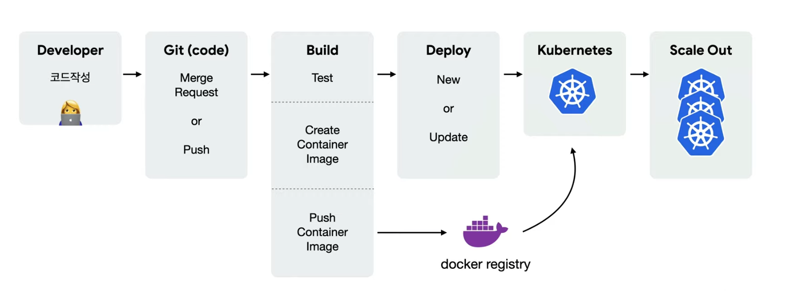
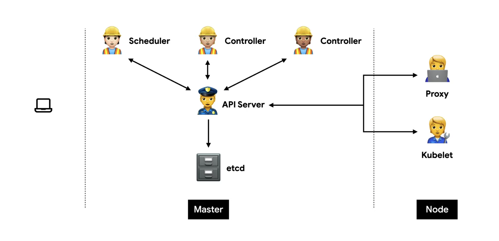
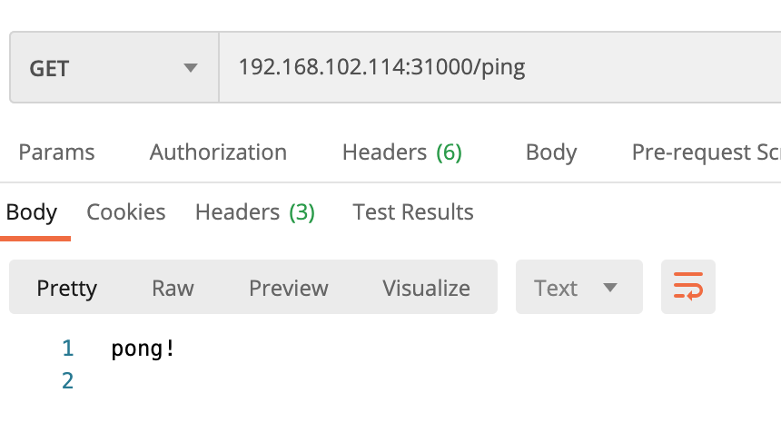

<br>

> # 쿠버네티스 
컨테이너화 된 애플리케이션을 자동으로 배포, 스케일링 및 관리해주는 오픈소스 시스템



<br><br><br>

쿠버네티스 - '원하는 상태'를 유지하는 것이 핵심이다.<br>
Desired State<br><br>

1. 상태체크(Observe) <br>
Current State == Desired State<br>

2. 차이점 발견(Diff)<br>
Current State != Desired State<br>

3. 조치(Act)<br>
Current State => Desired State<br>




## Master - etcd
모든 상태와 데이터를 저장<br>
Key(directory)-Value 형태로 데이터 저장

## Master - API server
상태를 바꾸거나 조회<br>
etcd와 유일하게 통신하는 모듈<br>
REST API 형태로 제공<br>
권한을 체크하여 적절한 권한이 없을 경우 요청을 차단<br>
관리자 요청 뿐 아니라 다양한 내부 모듈과 통신<br>
요청이 많으므로 수평으로 확장하도록 디자인 되어있음 <br>

## Master - Scheduler
새로 생성된 Pod를 감지하고 실행할 노드를 선택 <br>
노드의 현재 상태와 Pod의 요구사항 체크<br>

## Master - Controller
논리적으로 다양한 컨트롤러가 존재<br>
끊임없이 상태를 체크하고 원하는 상태를 유지<br>
복잡성을 낮추기 위해 하나의 프로세스로 실행<br>


## Node - kubelet
각 노드에서 실행
Pod을 실행/중지하고 상태를 체크
컨테이너를 pod으로 감싸서 실행하는 것!

## Node - proxy
네트워크 프록시와 부하 분산 역할

<br><br><br>
# yml 필수 요소 
```yml
apiVersion: v1
kind: Pod
metadata:
  name: echo
  labels:
    app: echo
spec:
  containers:
    - name: app
      image: ghcr.io/subicura/echo:v1
```

|정의|설명|예|
|------|---|---|
|version|오브젝트 버전|v1, app/v1, networking.k8s.io/v1|
|kind|종류|Pod, ReplicaSet, Deployment, Service|
|metadata|메타데이터|name과 label, annotation(주석)으로 구성|
|spec|상세명세|리소스 종류마다 다름|

<br><br>

간단한 실습기억해두기위해 <br>

1. 격리된 논리공간 namespace 생성
```bash
$ kubectl create namespace hb-test
```
2. yaml 파일로 pod 생성
```yml
apiVersion: v1
kind: Pod
metadata:
  name: myapp-pod
  namespace: hb-test
  labels:
    app: myapp
spec:
  containers:
    - name: myapp-container
      image: repo.iris.tools/hb/hb-image:v1.0
```
3. 실행/확인
```bash
$ kubectl create -f sample-pod.yml -n hb-test
$ kubectl get pod -n hb-test
NAME        READY   STATUS    RESTARTS   AGE
myapp-pod   1/1     Running   0          26s
$ kubectl exec -it myapp-pod -n hb-test -- /bin/sh
/workspace/test # ls
Dockerfile        go.mod            go.sum            run_my_docker.sh  test1             test1.go
```

<br><br>


# Pod을 외부에 노출시키기 
Service 종류<br>
- ClusterIP
- NodePort
- Load Balancer

NodePort를 이용해서 외부에서 접속할 수 있도록 해보자.<br> 

sample-pod.yml
```yml
apiVersion: v1
kind: Pod
metadata:
  name: myapp-pod
  namespace: hb-test
  labels:
    app: helloApp
spec:
  containers:
     - name: myapp-container
       image: repo.iris.tools/hb/hb-image:v1.0
       ports:
          - containerPort: 1322
            protocol: TCP
```

my-nodeport.yml
```yml
apiVersion: v1
kind: Service
metadata:
  name: my-nodeport
spec:
  type: NodePort
  ports:
    - port: 9000
      targetPort: 1322
      nodePort: 31000
  selector:
    app: helloApp
```

```bash
$ kubectl create -f sample-pod.yml
$ kubectl create -f my-nodeport.yml

$ kubectl get all -n hb-test
NAME               READY   STATUS    RESTARTS   AGE
pod/myapp-pod   1/1     Running   0          52m

NAME                  TYPE       CLUSTER-IP     EXTERNAL-IP   PORT(S)          AGE
service/my-nodeport   NodePort   10.1.158.241   <none>        9000:31000/TCP   48m
```

노드의 공용 ip를 확인해서(ifconfig)<br>
node의 ip:nodeport

```bash
$ curl 192.168.102.114:31000/ping
pong!
```


# Service
> Cluster IP

> NodePort

(NodePort는 CluterIP의 기능을 기본으로 포함합니다.)

> Load Balancer

(LoadBalancer는 NodePort의 기능을 기본으로 포함합니다.)

<br><br>

# kubectl command 

> Endpoint : 서비스의 접속정보
```bash
$ kubectl describe ep/[서비스이름] 
```

> # 헷갈리는 개념 정리해보기
```yml
kind: Deployment
...
metadata: #1
  name: nginx
  labels:
    app: nginx
    tier: backend
spec:
  selector: #2
    matchLabels:
      app: nginx
  template: #3
    metadata:
      labels:
        app: nginx
        tier: backend
...
```
> ## metadata와 selector와 template에 관하여<br>

matchLabel: tells what pods the deployment will apply to <br>

먼저, 맨 위의 metadata(#1)는 deployment그 자체에 대한 설명이다.  <br><br>

The second selector, is actually a selector for the deployment to apply to the pod that the deployment is describing.

selector(#2)는 해당 deployment가 이부분에서 기술하고있는 pod에 적용하기 위한 라벨링을 하고있는 것. 즉 고를 것<br><br>

template(#3)은 사실 podTemplate 이다. 이 부분에서는 실행되는 pod에 대해 기술한다. 따라서 이 부분에 쓰여지는 label은 해당 deployment가 아니라 실행되는 pod에 대한 label이다. 즉 골라지는 것<br><br>

<br><br>
### > 그림출처 
[초보를 위한 쿠버네티스 안내서] 컨테이너 오케스트레이션이란?
https://www.youtube.com/watch?v=Ia8IfowgU7s 
